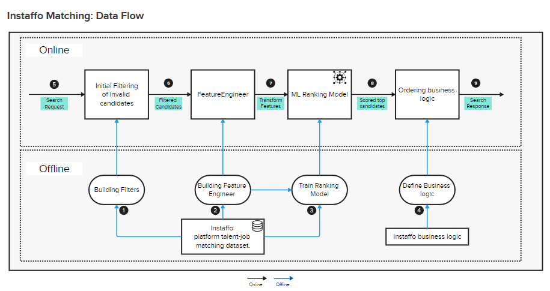

# Instaffo Matching System


[](https://codecov.io/gh/username/instaffo_matching)
[](https://badge.fury.io/py/instaffo-matching)


Instaffo Matching is Talent-Job Matching System designed to efficiently match job canidats with suitable job opportunities. Utilizing advanced machine learning techniques, natural language processing, and a multi-stage matching pipeline, this system provides highly accurate and explainable matches between talents and jobs.

## Table of Contents

- [Instaffo Matching System](#instaffo-matching-system)
  - [Table of Contents](#table-of-contents)
  - [Project Overview](#project-overview)
    - [Offline Environment](#offline-environment)
    - [Online Environment](#online-environment)
    - [Features](#features)
  - [Setup](#setup)
    - [Prerequisites](#prerequisites)
    - [Installation](#installation)
  - [Usage](#usage)
    - [Quick Start](#quick-start)
  - [Command Line Interface (CLI)](#command-line-interface-cli)
    - [Training the Model](#training-the-model)
    - [Evaluating the Model](#evaluating-the-model)
    - [Search Client (Batch and Single Match)](#search-client-batch-and-single-match)
  - [Interactive Notebooks](#interactive-notebooks)
  - [Model Performance and Insights](#model-performance-and-insights)
    - [Confusion Matrix](#confusion-matrix)
    - [Top Feature Importance:](#top-feature-importance)
    - [Advanced Usage](#advanced-usage)
    - [Support](#support)

## Project Overview

Instaffo Matching employs a multi-stage pipeline to ensure optimal matching between talents and jobs:



The system is split into offline and online components:

### Offline Environment

1. **Building Filters:** Establish criteria to filter out candidates who do not meet basic job requirements, streamlining the matching process by testing hypotesis based on Instaffo dataset.
   
2. **Building Feature Engineer**: This step involves, identifing custom transformations, bulding features and transforming raw data into structured features using techniques like TF-IDF, making the data suitable for model training.

3. **Model Training**: Train gradient boosting model using historical match data, incorporating engineered features to predict the likelihood of successful matches.

4. **Define Business Logic:** Defined and tuned logic to align the model's outputs with the platform's objectives and user needs.

### Online Environment

The online environment is optimized for low-latency responses to matching requests:

5. **Initial Filtering**: The `CandidateFilter` class quickly eliminates incompatible matches based on essential criteria, significantly reducing the search space.

26. **Feature Engineering**: The `FeatureEngineer` class transforms the input data into the same feature space used in our offline training.

7. **Machine Learning Prediction**: The `TalentJobRanker` class uses the trained ml model to predict match quality for the filtered candidates.

8. **Ordering Business Logic**: Potential matches are sorted based on predicted scores and additional criteria.

9. **Result Serving**: The top-ranked results are returned, representing the most promising talent-job matches.


### Features

- Advanced feature engineering
- Multi-stage search pipeline for efficient and accurate matching
- Asynchronous bulk matching capabilities
- Comprehensive logging and monitoring
- Scalable principals for high-volume processing
- (comming soon) Explainable AI integration using SHAP (SHapley Additive exPlanations)
- (comming soon) RESTful API with OpenAPI (Swagger) specification


**Key Classes:**
- `FeatureEngineer`: Handles data preprocessing and feature extraction. (`features/engineer.py`)
- `TalentJobRanker`: Manages model training, prediction, and lifecycle. (`models/ranker.py`)
- `CandidateFilter`: Quickly eliminates incompatible matches based on essential criteria. (`models/retriver.py`)
- `Search`: Orchestrates the end-to-end matching process. (`search/search.py`)

## Setup

### Prerequisites

Ensure you have the following installed:
- Python 3.9 or higher
- pip (Python package installer)

### Installation

1. Clone the repository:
   ```bash
   git clone https://github.com/aleksabisercic/instaffo_matching.git
   cd instaffo_matching
   ```
2. Install core dependencies:
    ```bash
    pip install -e .
    ```
3. (Optional) Install development for notebooks and visualization tools:
    ```bash
    pip install -e .[dev]
    ```

## Usage

### Quick Start

```python
from instaffo_matching.search.search import Search

search = Search()

# Define the talent's profile
talent = {
    "degree": "bachelor",
    "job_roles": ["frontend-developer", "backend-developer"],
    "languages": [
        {"rating": "C2", "title": "German"},
        {"rating": "C2", "title": "English"},
        {"rating": "B2", "title": "French"}
    ],
    "salary_expectation": 48000,
    "seniority": "junior"
}

# Define the job's requirements
job = {
    "job_roles": ["frontend-developer"],
    "languages": [
        {"title": "German", "rating": "C1", "must_have": True},
        {"title": "English", "rating": "B2", "must_have": True}
    ],
    "max_salary": 70000,
    "min_degree": "none",
    "seniorities": ["junior", "midlevel"]
}

# Perform the matching process
result = search.match(talent, job)

# Print the match results
print(f"Match Result: {result['label']}")
print(f"Match Score: {result['score']:.2f}")
```

## Command Line Interface (CLI)

### Training the Model

To train the model using the provided script, run the following command:

```bash
python scripts/train_model.py --data_path data/data.json --model_save_path models_artifacts/
```

### Evaluating the Model

To evaluate the model's performance, use the evaluation script:

```bash
# Usage from root directory:
python scripts/evaluate_model.py --data_path data/data.json --model_path ./models_artifacts/model_03_08_2024.joblib
```

### Search Client (Batch and Single Match)

To evaluate search implementation use search_example script:

```bash
# Usage from root directory:
python scripts/search_example.py --data_path data/data.json --model_path ./models_artifacts/model_03_08_2024.joblib
```


## Interactive Notebooks

I encourage you to explore Jupyter notebooks to gain deeper insights into initial thinking, exploratory analysis, feature engineering, and model training process:

- `01_exploratory_data_analysis.ipynb`: Initial data exploration and insights
- `02_exploratory_filter_analysis.ipynb`: Analysis of filtering techniques
- `03_feature_engineering_and_model_training_v1.ipynb`: First iteration of feature engineering and model training
- `04_feature_engineering_and_model_training_v2.ipynb`: Less graphs in training more like script
- `05_search_implementation_example.ipynb`: Demonstration of the Search functionality

These notebooks provide a comprehensive look at the how it looked before development process and can help you understand the reasoning behind some decisions.

To run the notebooks:

1. Ensure you've installed the development dependencies:
   ```bash
   pip install -e .[dev]
   ```
2. Start Jupyter Lab:
   ```bash
   jupyter lab
   ```
3. Navigate to the `notebooks/` directory and open the desired notebook.

## Model Performance and Insights

Model achieves excellent performance in matching talents with job opportunities:

|               | Precision | Recall | F1-Score | Support |
|---------------|-----------|--------|----------|---------|
| **False**     | 0.99      | 0.99   | 0.99     | 200     |
| **True**      | 0.99      | 0.99   | 0.99     | 200     |
| **Accuracy**  |           |        | 0.99     | 400     |
| **Macro Avg** | 0.99      | 0.99   | 0.99     | 400     |
| **Weighted Avg** | 0.99   | 0.99   | 0.99     | 400     |

### Confusion Matrix

|              | Predicted False | Predicted True |
|--------------|-----------------|----------------|
| Actual False | 199             | 1              |
| Actual True  | 2               | 198            |


### Top Feature Importance:

| Feature                        | Importance |
|--------------------------------|------------|
| Degree Difference              | 0.236102   |
| Salary Difference Percentage   | 0.214210   |
| Role Similarity                | 0.162905   |
| Salary Ratio                   | 0.114169   |
| Language Match Score           | 0.112842   |
| Seniority Match (0.0)          | 0.107176   |
| Seniority Match (1.0)          | 0.048573   |

These results demonstrate the model's strong ability to identify suitable matches while considering various important factors in the hiring process. Special attention was given to thoroughly reviewe the training code, including aspects related to data leakage and other crucial elements as results seemed too good. For more details, please refer to `03_feature_engineering_and_model_training_v1.ipynb` and `04_feature_engineering_and_model_training_v2.ipynb`.


### Advanced Usage

For more advanced usage, including bulk matching, explanation of results, and customization of the matching process, please refer to our detailed notebooks (`notebooks`) and source code in `instaffo_matching`.

### Support

For support, please open an issue on our GitHub issue tracker or contact at aleksabisercic@gmail.com